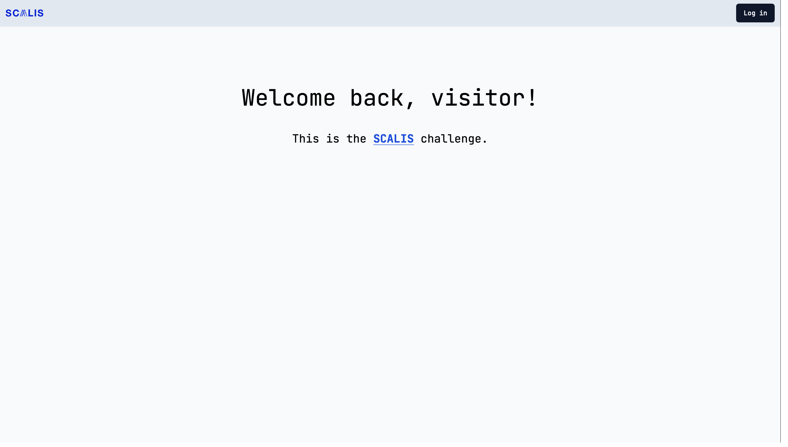
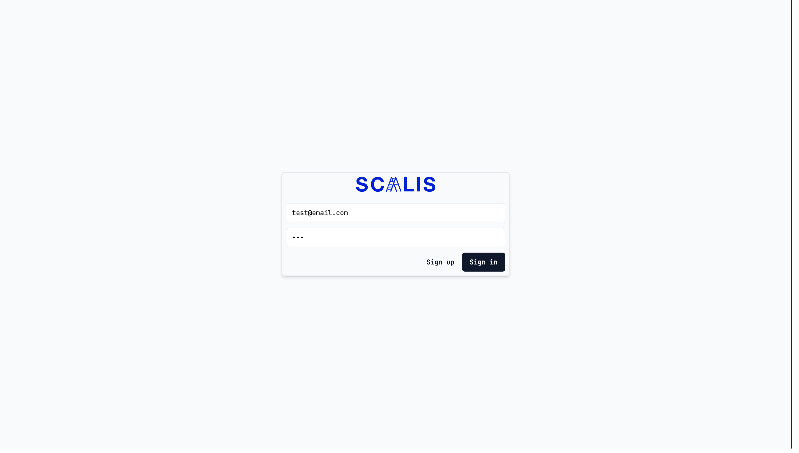
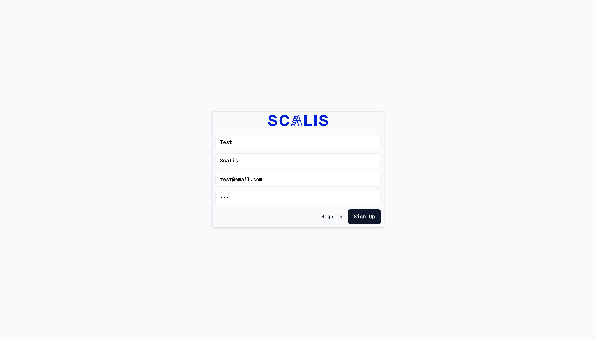
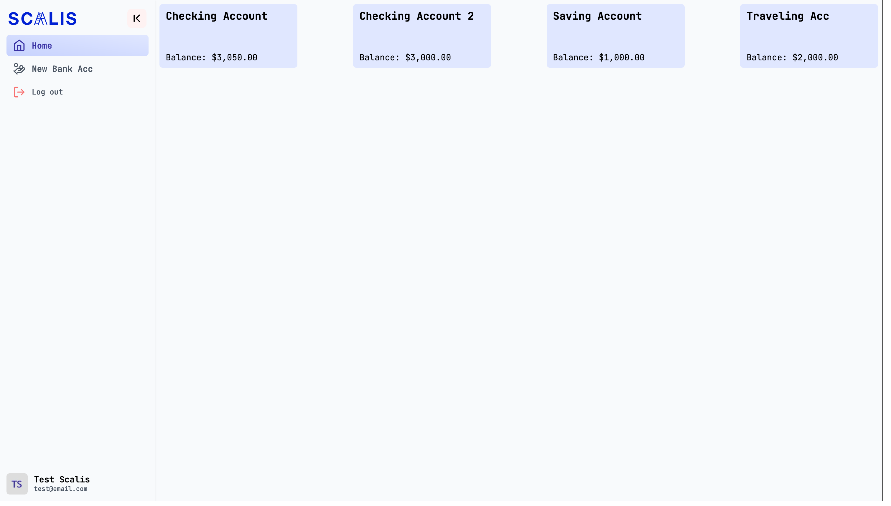
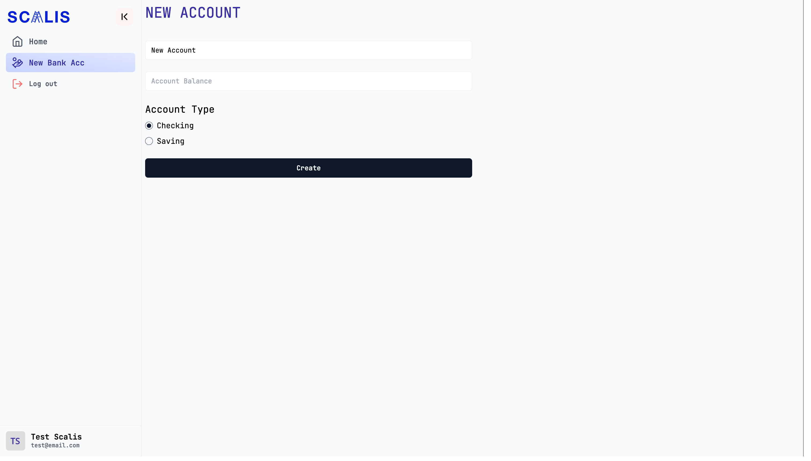
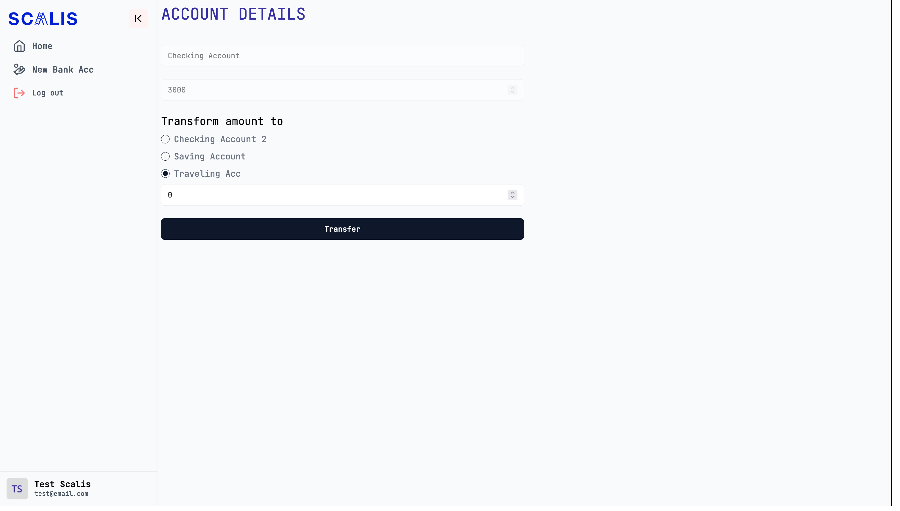
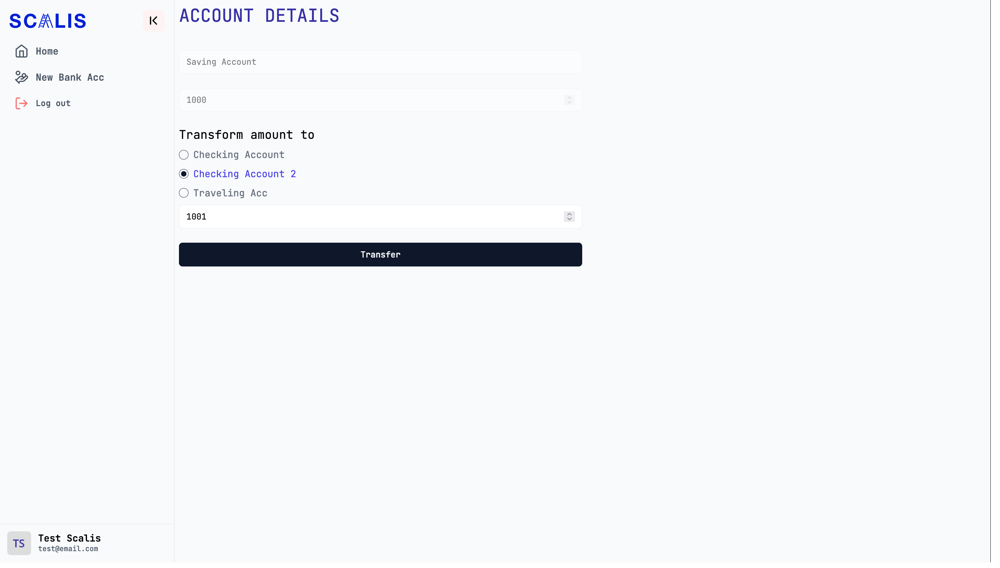
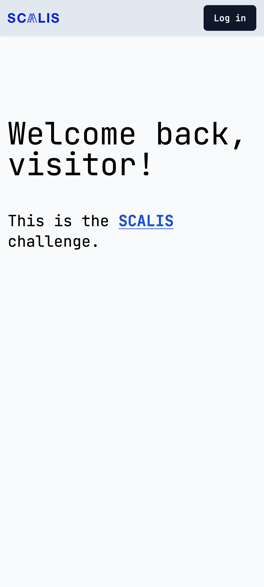
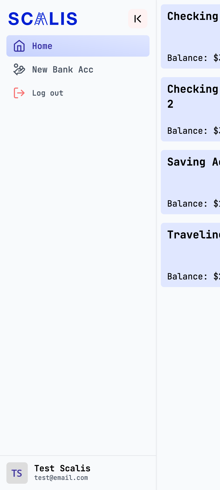
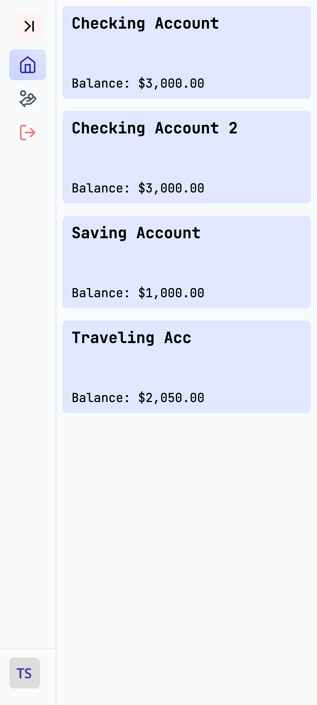

# SCALIS CHALLENGE - Simple Full-Stack Application using Next.js

## About
This project is a demonstration of my proficiency in building production-ready full-stack applications, focusing on frontend, backend, testing, and version control. The application is built using `Next.js`, `NextAuth`, `Shadcn-ui`, `TailwindCSS`, `Vitest`, with `SQLite` for backend data storage and comprehensive unit tests to ensure reliability.

## Getting Started

First, run the development server:

```bash
# RUN
yarn dev or yarn start

# BUILD
yarn build


# TESTS
yarn test

# COVERAGE
yarn test:cov
```

Open [http://localhost:3000](http://localhost:3000) with your browser to see the result.

## Application Screenshots











